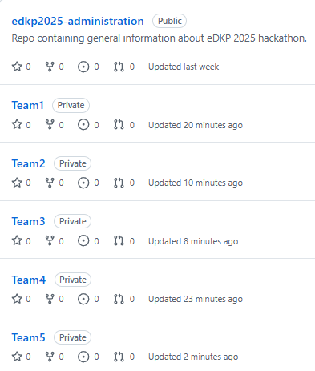
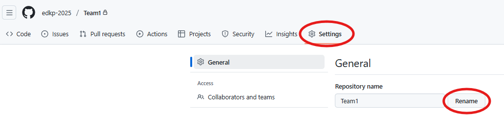
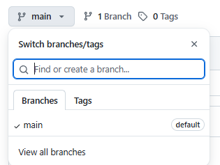
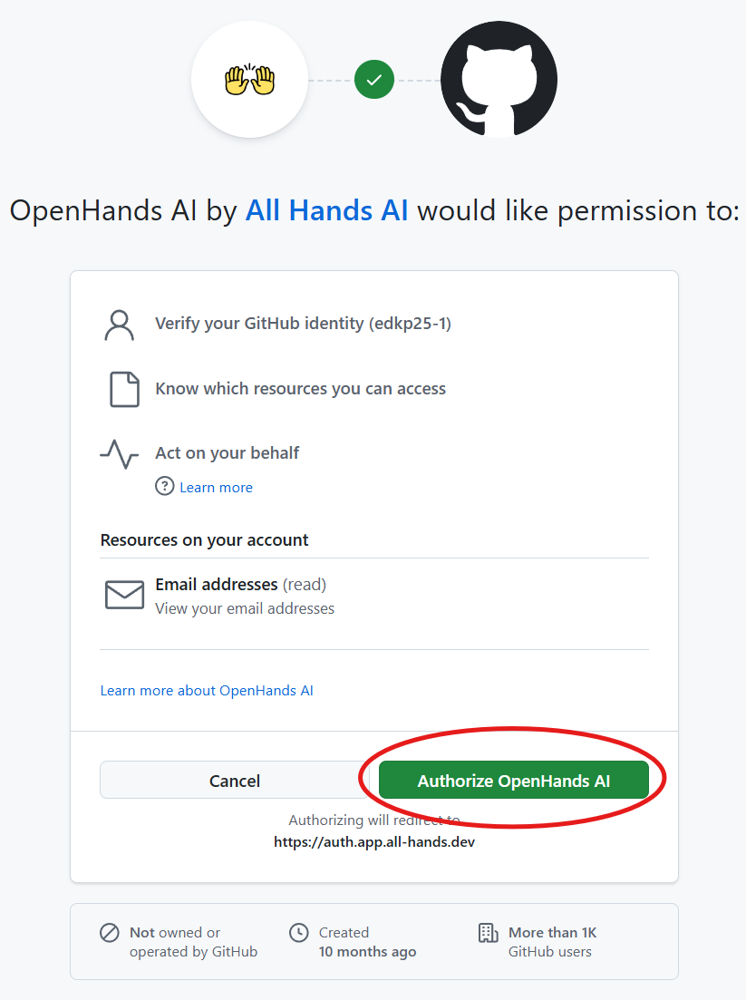
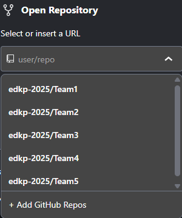
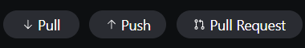

# eDKP 2025 Guide

## Table of Contents
- [Requirements](#requirements)
- [Setup](#setup)
- [Delieverables](#deliverables)
- [Best Practices](#best-practices)

## General Information
Welcome to the eDKP 2025 hackathon.  
This guide will help you get up and running quickly so you can get started hacking.

## Requirements
1. At least 1 person in your team must bring a laptop that has Python3 installed, and is able to run Python code in your IDE of choice.  
2. Your own laptop **MUST** be able to access OpenHands Cloud ([link](https://app.all-hands.dev/)) and Github ([link](https://github.com/)).
3. If your usecase requires data, please bring either of the following:  
i. Prepare (eg. mask / anonymize) and bring your own data.  
ii. If you need news data, inform us and we will provide you with a Tavily API key. ([ref](#3-tavily-for-news-related-team-only))

## Constraints
1. OpenHands Cloud instance resources: 4 CPU, 16Gb RAM
2. No GPUs
3. No dedicated databases / object storage facilities

## Setup
Follow the setup steps in this order:
### 1. Github
Github is a platform to share code for collaborative development.  
Your team repositories have been prepared for you beforehand. Check that you are able to access it using the steps below:
1. Navigate to Github, specifically the page for eDKP2025. ([link](https://github.com/edkp-2025/))
2. Sign in with the login credentials provided to you.
3. A Github repository has been created for each of your teams:
  
4. Click into your team's repository. It should be completely empty.  
5. We encourage you to rename your repository. Click onto the 'Settings' tab, thereafter change the value in the text field:  

6. Create different feature branches per member (this helps to manage conflicts when writing to the same files):   
i. Click on the drop-down under your repository's name that either has 'main' / 'master' (this is your branch selector).  
ii. Type the name of your new branch to create it.  
  

> ⚠️ **DO NOT** create more than 1 repo per team  

> ℹ️ For information on how your team should use Github for collaboration, please refer [here](#best-practices)

### 2. OpenHands Cloud
OpenHands Cloud is a low to no-code AI-assisted coding platform that is accessible as a webapp in your browser. It is integrated tightly with Github, which allows it to seamlessly build your code and merge it to your Github repository. We will be using 'OpenHands' and 'OpenHands Cloud' synonymously.  
Follow the steps below to access OpenHands:
1. Navigate to OpenHands Cloud. ([link](https://app.all-hands.dev/))
2. Sign in with the Github login credentials provided to you.  
3. There may be a pop-up to grant OpenHands permissions to access the Github account. If it appears, click on the 'Authorize' button.  

4. If there is a pop-up to accept terms of service, accept it.
5. Within the 'Open Repository' box, click on the 'user/repo' drop-down selector and choose your Team's repository. Your team's Github repository should already be added to OpenHands:  
  
6. Click on the 'Select branch...' drop-down selector and choose the feature branch you created. ([see](#1-github)  Setup>Github>Step6)
7. Click on the 'Launch' button to start your session.
8. Use the chat interface to start vibe-coding. Refer to the [best practices](#best-practices) section below for tips on how to get the most out of OpenHands Cloud!

> ℹ️ For information on how to use 👐 OpenHands Cloud, please refer to the official [docs](https://docs.all-hands.dev/)

### 3. Tavily (For news-related team only)
Tavily is a tool that enables search and extraction of web content, typically for LLM usage.  
Please reach out to your facilitator for the API key.

> ℹ️ For information on how to use Tavily, please refer to the official [docs](https://docs.tavily.com/documentation/api-reference/endpoint/search).

## Recommended Stacks
1. Python: FastAPI backend + Streamlit frontend 
2. Javascript: Next.js
> ⚠️ Javascript may not have all the same ML / NLP libraries in Python.  

## Deliverables
1. Final presentation.
2. 🥳**Bonus**🥳 A working app that runs locally in your machine.

## Best Practices
### Collaborating using Github
- Typically a team using Github would create a main branch to host stable / tested code, whilst team members can concurrently develop on feature branches. This enables version control when merging code with conflicts (think of writing over the same sentence in a shared Word .docx).
- When working on a feature, the Git / Github workflow should look something like this (🟠 for action taken using Git, 🔵 for GitHub):
    ```mermaid
    graph LR
        A[main branch] --> B[git checkout -b feature-branch]
        B --> C[Make code changes]
        C --> D[git add .]
        D --> E["git commit -m 'message'"]
        E --> F[git push origin feature-branch]
        F --> G[Create Pull Request]
        G --> H[Code Review]
        H --> I[Merge Pull Request]

        classDef git fill:#f96,stroke:#333,stroke-width:2px
        classDef github fill:#6cf,stroke:#333,stroke-width:2px

        class A,B,C,D,E,F,K,L git
        class G,H,I,J github
    ```

> ⚠️ Do get your teammates to review your code before merging the pull request!

> ℹ️ For information on the typical Git + Github workflow, please refer to the this tutorial [video](https://www.youtube.com/watch?v=nCKdihvneS0).

> ℹ️ For information on 👐 OpenHands Cloud + Github integration, please refer to the the official [docs](https://docs.all-hands.dev/usage/cloud/github-installation#working-with-github-repos-in-openhands-cloud).


### Vibe-Coding using 👐 OpenHands Cloud
1. Start by telling OpenHands the following in a single prompt:  
i. instruction to create a plan on how to perform your feature step-by-step.  
ii. details of your feature.  
iii. instruction to **NOT** return any code - just return the plan alone.  
iv. clarify with you at any step if unsure.  
v. (optional) create test cases to test key functionalities.  
    ```
    # Example
    Think step-by-step and create a plan to create a Python FastAPI backend and Streamlit frontend for a RAG app.

    The app is expected to allow users to:
    1. Upload a .pdf document.
    2. Enter an Anthropic API key for a QnA agent to chat about the document.
    3. Chat with an agent about the document via a chat interface.
    4. Delete the document.

    Under the hood, the app should:
    1. Parse the document and convert it into embeddings.
    2. Store embeddings in a local instance of a vector store.
    3. Rank the best results post-retrieval.
    4. Connect to an Anthropic LLM endpoint (Sonnet 4) for QnA.

    Feel free to suggest the best vector store and ranking algorithm for my app.
    Only create a to-do list for planning - DO NOT return any code.
    Ask me questions if you require any clarifications.
    ```
2. After the plan is created and is within your chat history, go ahead and tell OpenHands to execute the plan. You may opt to tell it not to overcomplicate things and keep code logic as simple as possible.
3. You can review the code generated under the 'Changes' tab in OpenHands - changes are organized by the files they are written in. Thereafter, you can get OpenHands to run unit / integration tests, and fix any bugs.
4. Save your work frequently using the 'Push' and 'Pull Request' buttons at the bottom of your chatbox:  
  

    i. Push: Do this after you are satisfied with every minor change done to your feature branch.  
    ii. Pull Request: Do this after you are satisfied with your entire feaure branch. You will have to head to your team's repository on Github, click on the 'Pull Request' tab, and approve your pull request to merge your feature branch into the 'main / master' branch. Refer to the 'Git / Github workflow' video under the ['Collaborating using Github'](#best-practices) section for more information on pull requests.
