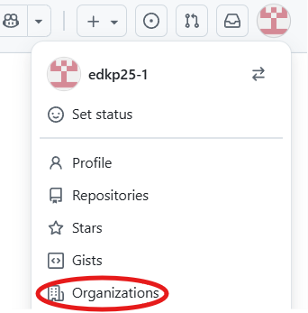
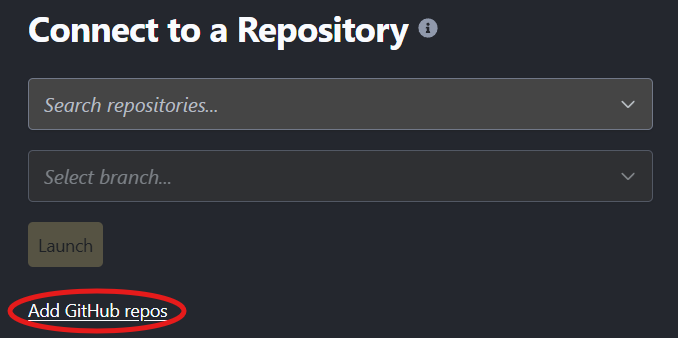
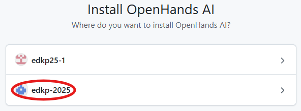
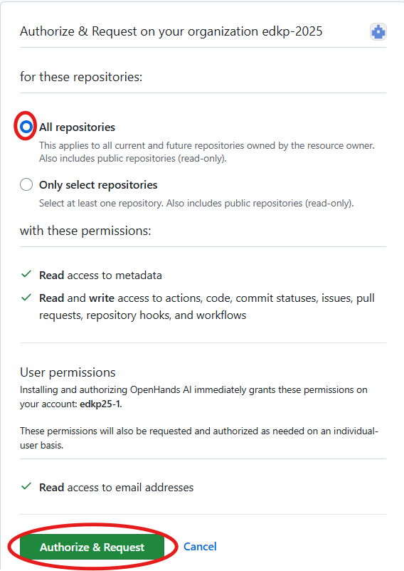
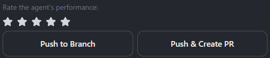

# eDKP 2025 Guide

## Table of Contents
- [Requirements](#requirements)
- [Setup](#setup)
- [Delieverables](#deliverables)
- [Best Practices](#best-practices)

## General Information
Welcome to the eDKP 2025 hackathon.  
This guide will help you get up and running quickly so you can get started hacking.

## Requirements
1. At least 1 person in your team must bring a laptop that:  
i. has Python3 installed, and is able to run Python code in your IDE of choice.  
ii. is able to access Github. ([link](https://github.com/))
2. Your own laptop **MUST** be able to access OpenHands Cloud ([link](https://app.all-hands.dev/))
3. If your usecase requires data, please bring either of the following:  
i. Prepare (eg. mask / anonymize) and bring your own data.  
ii. If you need news data, inform us and we will provide you with a Tavily API key. ([ref](#3-tavily-for-news-related-team-only))

## Setup
Follow the setup steps in this order:
### 1. Github
Github is a platform to share code for collaborative development.
1. Navigate to Github, specifically the page for eDKP2025. ([link](https://github.com/edkp-2025/))
2. Sign in with the login credentials provided to you.
3. One person in your team must create your team's Github repository.  
i. First navigate to the hackathon's Github organization. Click onto your profile icon on the top right corner, and select "Organizations".  
  
ii. Click into 'edkp-2025'.  
iii. Refer to the official [docs](https://docs.github.com/en/repositories/creating-and-managing-repositories/creating-a-new-repository) for the next steps. There is no need for a license or .gitignore.


> ⚠️ **DO NOT** create more than 1 repo per team  

> ℹ️ For information on how your team should use Github for collaboration, please refer [here](github.md)

### 2. OpenHands Cloud
OpenHands Cloud is a low to no-code AI-assisted coding platform that is accessible as a webapp in your browser. It is integrated tightly with Github, which allows it to seamlessly build your code and merge it to your Github repository.
1. Navigate to OpenHands Cloud. ([link](https://app.all-hands.dev/))
2. Sign in with the Github login credentials provided to you.  
3. There may be a pop-up to grant OpenHands permissions to access the Github account. Click on the 'Authorize' button.  

4. If there is a pop-up to accept terms of service, accept it.
5. Add your Github repo to OpenHands:  
i. Click on 'Add Github repos'.  

ii. A new tab should open and show your Github user, and the hackathon organization 'edkp-2025'. Click on the organisation 'edkp-2025'. 
  
iii. Select the 'All repositories' radio box then click on 'Authorize'.
  
iv. You will be redirected back to OpenHands. If your team's Github repository is already created, it should appear in the 'Search repositories' drop-down.

> ℹ️ For information on how to use 👐 OpenHands Cloud, please refer to the official [docs](https://docs.all-hands.dev/)

### 3. Tavily (For news-related team only)
Tavily is a tool that enables search and extraction of web content, typically for LLM usage.  
Please reach out to your facilitator for the API key.

> ℹ️ For information on how to use Tavily, please refer to the official [docs](https://docs.tavily.com/documentation/api-reference/endpoint/search).

## Recommended Stacks
1. Python: FastAPI backend + Streamlit frontend 
2. Javascript: Next.js
> ⚠️ Javascript may not have all the same ML / NLP libraries in Python.  

## Deliverables
1. Final presentation.
2. 🥳**Bonus**🥳 A working app that runs locally in your machine.

## Best Practices
### Collaborating using Github
- Typically a team using Github would create a main branch to host stable / tested code, whilst team members can concurrently develop on feature branches. This enables version control when merging code with conflicts (think of writing over the same sentence in a shared Word .docx).
- When working on a feature, the Git / Github workflow should look something like this (🟠 for action taken using Git, 🔵 for GitHub):
    ```mermaid
    graph LR
        A[main branch] --> B[git checkout -b feature-branch]
        B --> C[Make code changes]
        C --> D[git add .]
        D --> E["git commit -m 'message'"]
        E --> F[git push origin feature-branch]
        F --> G[Create Pull Request]
        G --> H[Code Review]
        H --> I[Merge Pull Request]

        classDef git fill:#f96,stroke:#333,stroke-width:2px
        classDef github fill:#6cf,stroke:#333,stroke-width:2px

        class A,B,C,D,E,F,K,L git
        class G,H,I,J github
    ```
- However, for a low to no-code experience using Github + OpenHands Cloud, you may opt to:
1. Work off your 'main' branch in OpenHands, **BUT** remember to use the OpenHands agent's 'Push & Create PR' tool which will automatically create a new feature branch for you ([ref](#vibe-coding-using--openhands-cloud)).
2. Create a new branch from the Github webpage:   
i. Click on the drop-down under your repository's name that either has 'main' / 'master' (this is your branch selector), then type the name of your new branch to create it.  
  
ii. Head back to OpenHands Cloud and choose your feature branch from the repository and branch drop-down selectors.
iii. Vibe-code away in your separate feature branch. Openhands is smart enough to divide your task into different Git commits (updates).  
iv. When done, either head over to Github and create a pull request manually to merge your feature branch into main, or ask OpenHands Cloud to create the pull request (see *'Git + Github workflow'* video below).

> ⚠️ Do get your teammates to review your code before merging the pull request!

> ℹ️ For information on the typical Git + Github workflow, please refer to the this tutorial [video](https://www.youtube.com/watch?v=nCKdihvneS0).

> ℹ️ For information on 👐 OpenHands Cloud + Github integration, please refer to the the official [docs](https://docs.all-hands.dev/usage/cloud/github-installation#working-with-github-repos-in-openhands-cloud).


### Vibe-Coding using 👐 OpenHands Cloud
1. Start by telling OpenHands the following in a single prompt:  
i. instruction to create a plan on how to perform your feature step-by-step.  
ii. details of your feature.  
iii. instruction to **NOT** return any code - just return the plan alone.  
iv. clarify with you at any step if unsure.  
v. (optional) create test cases to test key functionalities.
2. After the plan is created and is within your chat history, go ahead and tell OpenHands to execute the plan. You may opt to tell it not to overcomplicate things and keep code logic as simple as possible.
3. You can review the code generated under the 'Changes' tab in OpenHands - changes are organized by the files they are written in. Thereafter, you can get OpenHands to run unit / integration tests, and fix any bugs.
4. Either click on the options in your OpenHands chat to 'Push & Create PR' as shown below, or explicitly ask OpenHands to do so. You can review this on Github under your repository's 'Pull Requests' tab.  
 
